<div align="center">

# Carousel Lab

**Turn proven TikTok photo carousels into evidence-backed, editable content — without a scraping API.**

Search a niche, rank hundreds of carousels, review the useful ones, extract repeatable patterns, generate product-aware storyboards, source Pinterest visuals, and export production-ready slides from one local workspace.

[](https://github.com/Danprog4/tt-carousels/actions/workflows/ci.yml)
[](https://nodejs.org/)
[](#data-and-privacy)
[](LICENSE)

</div>

> [!IMPORTANT]
> Carousel Lab is an early, local-first research tool. It is not affiliated with TikTok, Pinterest, or OpenAI. Use it responsibly, respect platform terms and rate limits, and verify image reuse rights before publishing.

## What Carousel Lab does

Most content research tools stop at a spreadsheet of links. Carousel Lab keeps the evidence connected all the way to production:

```mermaid
flowchart LR
    A["Research brief"] --> B["TikTok carousel search"]
    B --> C["Low-cost AI ranking"]
    C --> D["Fast human review"]
    D --> E["Visual pattern analysis"]
    E --> F["Evidence-backed playbooks"]
    F --> G["3 editable storyboards"]
    G --> H["Pinterest visual sourcing"]
    H --> I["PNG + copy export"]
```



The result is not a generic AI carousel. Every playbook remains traceable to real posts, creators, structures, and observed performance signals.

## Highlights

- **No scraping API required.** Uses a dedicated, visible Chrome profile that you sign into yourself.
- **TikTok photo carousels only.** Captures every slide, creator, caption, search rank, and available engagement metrics.
- **Research at useful scale.** Run 50-result tests or larger 500–1,000-result passes split into sequential query batches.
- **Cost-aware AI pipeline.** Cheap metadata ranking happens first; visual analysis runs only on the selected corpus.
- **Human-in-the-loop review.** Keep, maybe, skip, and pin decisions override AI without destroying the original assessment.
- **Performance-aware ordering.** Posts below 1,000 known views are kept for inspection but moved to the bottom and excluded from AI spend.
- **Multi-axis pattern mining.** Classifies visual source, narrative structure, slide roles, and product-funnel mechanics independently.
- **Evidence-backed playbooks.** Reusable content systems retain their supporting posts, creators, and median metrics.
- **Product-aware generation.** Every storyboard includes a native app transition and App Store CTA, even when the source carousel had no ad.
- **Pinterest production desk.** Queries are generated per slide, searched in the background, cached, and restored instantly on reopen.
- **Autosave everywhere.** Editor actions are written immediately to `localStorage` and synchronized to SQLite automatically.
- **Flexible export.** Download `1080×1920` PNGs with text, clean images without text, the full copy, and source links.

## Requirements

| Requirement | Notes |
| --- | --- |
| macOS | The included Chrome launcher currently targets Google Chrome in `/Applications`. The core app can work on other operating systems if Chrome is started manually with a CDP endpoint. |
| Node.js `22.19+` | Required by the bundled AI runtime. |
| Google Chrome | Keep the dedicated research profile open while TikTok or Pinterest searches are running. |
| TikTok account | Sign in manually inside the dedicated Chrome profile. |
| Pinterest account | Sign in manually in the same research profile for visual search. |
| OpenAI/Codex access | Optional for scraping and manual review; required for ranking, visual analysis, playbooks, and storyboard generation. |

No TikTok scraping subscription, Pinterest API key, or cloud database is required.

## Quick start

### 1. Install

```bash
git clone https://github.com/Danprog4/tt-carousels.git
cd tt-carousels
npm install
```

### 2. Start the dedicated research Chrome

```bash
npm run chrome:start
```

This creates a clean Chrome user-data directory at:

```text
~/Library/Application Support/Google/Chrome-TikTok-Research
```

Sign into **TikTok** and **Pinterest** in that window, then leave it open.

Carousel Lab never copies, opens, or modifies your normal Chrome profile. If you intentionally want to reuse another profile, copy it yourself only after fully quitting Chrome.

### 3. Authenticate AI features

```bash
npm run ai:login
```

Inside the Pi prompt:

1. Enter `/login`.
2. Choose `OpenAI/Codex`.
3. Complete the browser sign-in.
4. Exit with `Ctrl+C` after authentication succeeds.

Authentication stays in Pi's local credential store. Carousel Lab does not write the token to its database or repository.

### 4. Run the app

```bash
npm start
```

Open [http://127.0.0.1:4318](http://127.0.0.1:4318).

`npm start` builds the frontend and starts the local server. For active development with hot reload, use `npm run dev` and open [http://127.0.0.1:5173](http://127.0.0.1:5173).

## Try the UI without scraping

Create a local demo research run:

```bash
npm run seed:demo
npm start
```

The demo contains synthetic carousel records and generated placeholder images. It does not contact TikTok or Pinterest.

## Product workflow

### 1. Create a research project

Treat a project as a persistent niche or app workspace. Define:

- topic and audience;
- commercial goal;
- what should be included or excluded;
- several related TikTok search queries;
- the target number of unique carousels.

For a new niche, start with **50–100 results** before launching a larger pass.

### 2. Run multiple research passes

Each project behaves like a folder. A pass is a separate scrape with its own results, decisions, analysis, and outputs.

Use the `+` beside a project to create a new pass. Carousel Lab can:

- target 100, 300, 500, or 1,000 unique results;
- divide the work across multiple search-query batches;
- stop once the target is reached;
- exclude posts already seen in previous passes;
- remember the project's default queries and target.

### 3. Rank and review

The first AI pass receives only captions, query matches, ranks, and metrics — never images. Results are ordered into:

| Bucket | Meaning |
| --- | --- |
| Skip | AI found little useful evidence. |
| Maybe | The metadata is ambiguous and worth a quick human look. |
| Relevant | Strong niche fit, reusable structure, or a valuable product funnel. |
| Low data | Fewer than 1,000 known views; retained at the bottom without consuming AI quota. |

Manual review is optional. AI-relevant posts already enter the analysis corpus. Use `×`, `?`, `✓`, or pin only when you want to correct or emphasize something.

### 4. Mine patterns

The visual pass analyzes the selected corpus using each post's cover and numbered contact sheet. It extracts independent axes instead of forcing every post into one vague category:

- **visual source:** Pinterest-like, UGC/selfie, stock/editorial, AI photoreal, AI illustration, AI mascot, app screenshots, meme template, mixed;
- **content structure:** tips list, routine, problem → solution, mistakes → fixes, tutorial, transformation, and more;
- **slide roles:** hook, setup, problem, proof, tip, transition, product, CTA, ending;
- **product mechanic:** no product, product-as-tip, app demo, mid-carousel insert, end card, affiliate/ad, link-in-bio.

The resulting playbooks include real evidence posts, creator counts, median metrics, hook formulas, and a proposed slide flow.

### 5. Generate storyboards

Choose a playbook and provide an app brief. Carousel Lab returns exactly three editable variants:

1. a safe adaptation of the observed pattern;
2. a workflow with a native mid-carousel app integration;
3. a fresh angle where product personalization becomes the payoff.

Every variant contains one or two product slides. The app is inserted only after the content establishes a relevant pain, mechanism, or useful advice.

The included defaults use `bloatfit` as an example app brief; replace them with your own product details before generating.

### 6. Source visuals and edit

Each non-product slide receives a concrete Pinterest query. When the editor remains open for five seconds, missing unique queries run sequentially in the background.

Previously searched candidates appear immediately for every slide. Searches and thumbnails are cached locally, while manual **Refresh** replaces an older result set.

All editor changes autosave:

- slide copy and visual direction;
- Pinterest query and selected image;
- text placement, alignment, scale, and overlay;
- active storyboard tab and slide;
- cached Pinterest candidates.

### 7. Export

- **ZIP with text** — rendered `1080×1920` PNG slides using TikTok Sans.
- **ZIP without text** — clean images for adding native text inside TikTok or another editor.
- `COPY.txt` — the active carousel's complete copy.
- `SOURCES.txt` — selected Pinterest source links and queries.

## Data and privacy

Carousel Lab is local-first by design.

| Data | Location |
| --- | --- |
| Research projects, posts, decisions, patterns, drafts | `data/carousel-lab.sqlite` |
| Image thumbnails and contact sheets | `data/cache/` |
| In-progress editor recovery | Browser `localStorage` |
| TikTok and Pinterest sessions | Dedicated Chrome profile outside the repository |
| OpenAI/Codex authentication | Pi's local credential store |

The entire `data/` directory, `.env` files, build output, and dependencies are ignored by Git. Nothing is automatically posted, liked, followed, commented, or uploaded to TikTok or Pinterest.

To reset all Carousel Lab research data, stop the app and move the `data/` directory somewhere safe. A new database will be created on the next start.

## Configuration

Environment variables are optional:

| Variable | Default | Purpose |
| --- | --- | --- |
| `PORT` | `4318` | Local backend and production UI port. |
| `CHROME_CDP_ENDPOINT` | `http://127.0.0.1:9222` | Dedicated Chrome DevTools endpoint. |
| `CAROUSEL_DB_PATH` | `./data/carousel-lab.sqlite` | Custom SQLite database location. |
| `PI_NODE_EXECUTABLE` | current Node.js executable | Explicit Node `22.19+` binary for AI workers. |

Example:

```bash
PORT=4400 CAROUSEL_DB_PATH=/absolute/path/carousel-lab.sqlite npm start
```

## Commands

| Command | Purpose |
| --- | --- |
| `npm start` | Build and run the production app on port `4318`. |
| `npm run serve` | Run the already-built production app. |
| `npm run dev` | Start the backend and Vite dev server with hot reload. |
| `npm run chrome:start` | Start or reconnect the dedicated research Chrome on macOS. |
| `npm run ai:login` | Open the one-time Pi authentication flow. |
| `npm run seed:demo` | Add a synthetic demo research pass. |
| `npm run pinterest:search -- "query" 20` | Test Pinterest search without the UI. |
| `npm test` | Run the automated test suite. |
| `npm run typecheck` | Run TypeScript validation. |
| `npm run build` | Typecheck and build the frontend. |

## Architecture

```text
src/client/                React 19 + Vite workspace
src/server/app.ts          Express API and production static server
src/server/database.ts     SQLite persistence and migrations
src/server/tiktok.ts       Background TikTok photo-search collector
src/server/pinterest.ts    Background Pinterest visual search
src/server/*-worker.ts     Isolated AI ranking, vision, playbook, and draft jobs
src/server/carousel-*.ts   Image rendering and ZIP export
src/shared/                Shared contracts, types, and ranking rules
scripts/                   Dedicated Chrome and AI login helpers
```

Key implementation choices:

- Chrome is controlled through Playwright over CDP.
- Research tabs are created in the background and closed after each batch.
- SQLite is the durable source of truth; `localStorage` is an immediate editor recovery layer.
- AI workers run as isolated processes so long-running model calls cannot block the local API.
- Zod schemas validate every AI response before it enters the database.
- Visual analysis and Pinterest search are cached to avoid repeated cost and work.

## Troubleshooting

### “Chrome is not connected”

Run `npm run chrome:start` and keep that Chrome window open. Verify the endpoint:

```bash
curl http://127.0.0.1:9222/json/version
```

### TikTok returns no carousels

Open TikTok in the dedicated Chrome, confirm you are signed in, and complete any CAPTCHA or consent screen manually. Then retry with a broader query.

### Pinterest returns no images

Open Pinterest in the same dedicated Chrome and sign in manually. Existing cached results remain available even while Chrome is disconnected.

### AI authentication is missing

Run `npm run ai:login`, enter `/login`, and choose `OpenAI/Codex`. If your system Node is older than `22.19`, set `PI_NODE_EXECUTABLE` to a compatible binary.

### Port `4318` is busy

```bash
PORT=4400 npm start
```

## Current limitations

- The one-command Chrome launcher is macOS-specific.
- TikTok and Pinterest are unofficial browser integrations; platform markup or endpoints can change.
- This is a single-user local workspace, not a hosted multi-user service.
- Product slides currently use a text-first app card until custom app screenshots and reference assets are added.
- Engagement metrics are signals, not proof of causal content performance.

## Responsible use

- Research only content you are permitted to access.
- Respect platform terms, applicable laws, creator privacy, and reasonable rate limits.
- Do not treat Pinterest search results as a license to republish an image.
- Review health-related copy and avoid medical diagnoses, guarantees, or misleading claims.
- Keep generated content meaningfully transformative; do not copy creators' exact text or imagery.

## Contributing

Issues and pull requests are welcome. Read [CONTRIBUTING.md](CONTRIBUTING.md) before submitting a change.

Please include tests for data contracts, ranking behavior, persistence, or rendering changes, and run:

```bash
npm test
npm run build
```

## License

Carousel Lab is released under the [MIT License](LICENSE).

TikTok Sans is distributed under the SIL Open Font License; see [`assets/fonts/OFL.txt`](assets/fonts/OFL.txt). TikTok, Pinterest, OpenAI, and all other product names are trademarks of their respective owners.
